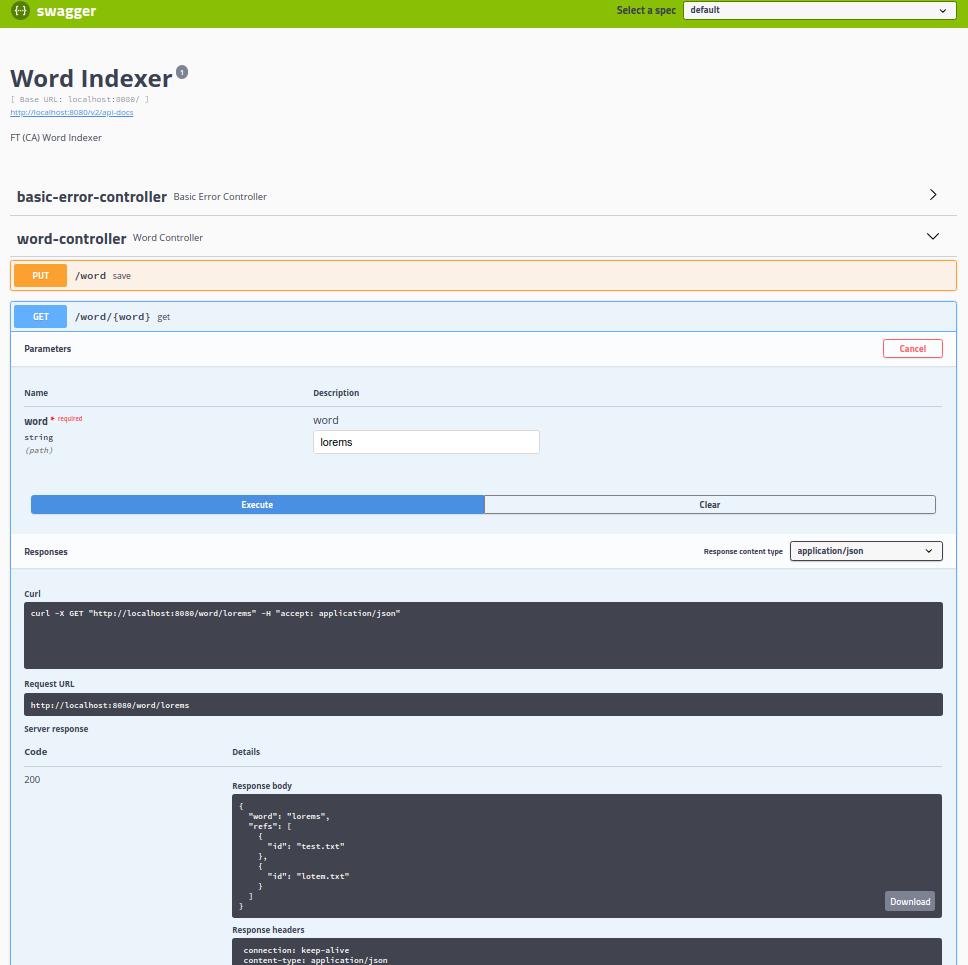
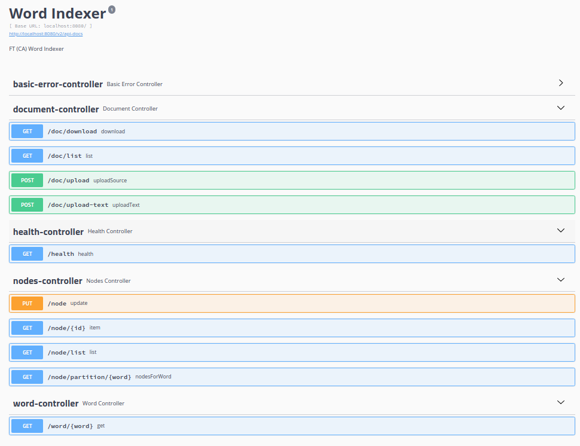

## FT word-indexer (AP by CAP)

##

### Система состоит из 3 модулей:

* Web gateway (Предоставляет API для загрузки файлов и поиска по словам)

* File worker (занимаются загрузкой/хранением файлов и извлечением слов)

* Index data nodes (хранят индекс слов с дополнительной мето-информацией: имя, id файла)

Не содержаит DB/MQ или каких либо внешних компонент для упрощения

### Для запросов используется Hystrix + Ribbon

Подробнее про каждый компонент:

#### Index data nodes

* Partitioning:

Использует Partitioning by hash of key, где Key - слово для партиционирования данных соответственно (Consistent hashing):

Как в Cassandra/Redis будет 256 партиций, каждая нода будет отвечать за рендж партиций и слать информацию о себе в виде heartbeat в gateway, пример данных {nodeUtl: "https/first-index-node:8080", partitions: "0:127", "health":"ok"}

Gateway будет использовать эту информацию для выбора куда слать запрос на поиск

Вопрос re-balancing не будет решен

* Replication:

Для упрощения не будет Leaders/Followers, дабы не тянуть внешнюю зависимость для Quorum Leader Election: Все реплики будут получать все данные, консистентность будет eventually 

Gateway будет выбирать рандомную ноду для поиска с нужной партицией с fallback на реплику

* Storage:

На файловой системе можно хранить в виде Tries но для упрощения будет хранится в персиситном кеше, сложность поиска будет константной, в варианте с Tries будет зависеть от длины слова

#### File worker

* Partitioning/Load balancing:

Тот же самый подход, что и для "Index data nodes" Но ключ будет именем файла, соответственно hash от имени файла

В случае отсутствия необходимости отдавать файл обратно, File worker могут слать информацию о загрузке (количества файлов в очереди, LA и т.д.)

Представляет собой простейший менеджер задач (SM):

    - Задача сохранения файла в директорию задач
    - Задача Извлечение слов
    - Задача Отправки данных в Index data nodes
    - MV файла
    - Проверка директории задач на необработанные таски
    - Задачи идемпотентны 

* Replication:

Gateway должен грузить файл на 2 репилки партиции

#### Web gateway

* Partitioning и Replication не требуется

Stateless, получает health-check от других компонентов и на основании этого занимается routing запросов

Свой health не отдает при старте, пока не получит информацию о всех партициях

Также для упрощения не будет метрик, трейсинга запросов и всего остального must have

Также для упрощения gateway и File worker один модуль
