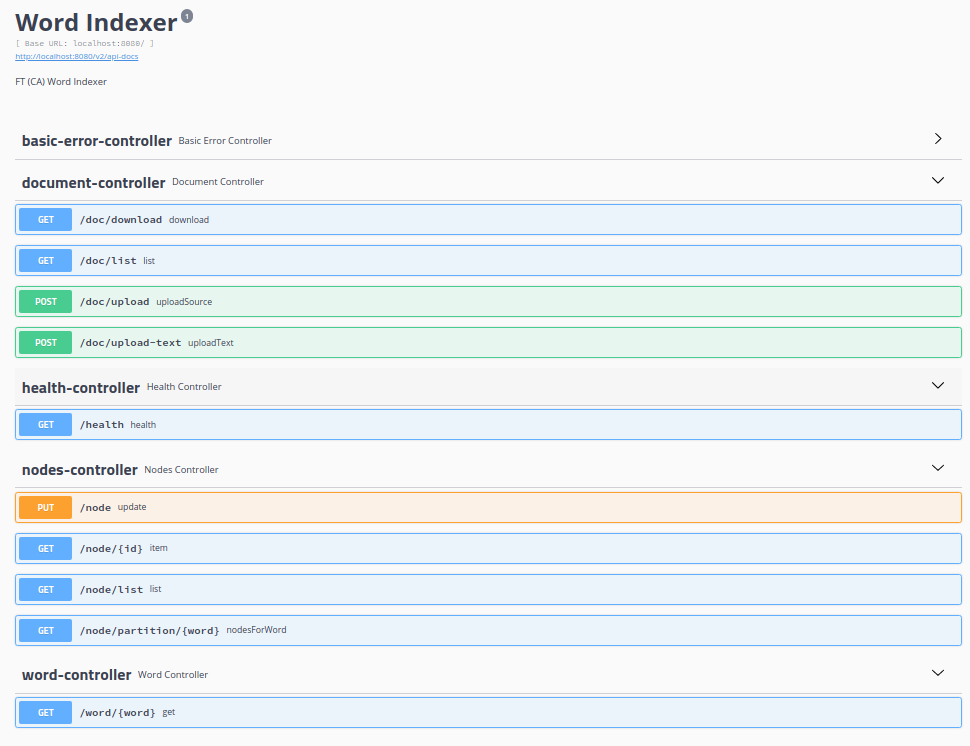

### Для запросов используется project reactor

Подробнее про каждый компонент:

#### Index data nodes


* Partitioning:

Использует Partitioning by hash of key, где Key - слово для партиционирования данных соответственно (Consistent hashing):

Как в Cassandra/Redis имеет 256 партиций, каждая нода отвечает за range партиций и шлёт информацию о себе в виде heartbeat в gateway, пример данных 
```
   {"nodeUrl": "https/first-index-node:8080", "startPartition": 0, "endPartition": 127, "health":true, "nodePort":8080}
```

Gateway использует эту информацию для выбора куда слать запрос на поиск.

Вопрос re-balancing не решен

* Replication:

Для упрощения нет Leaders/Followers, 
дабы не тянуть внешнюю зависимость для Quorum Leader Election: 
Все реплики получают все данные, консистентность eventually 

Gateway использует round-robin ноду для извлечения информации с нужной партицией с fallback на реплику

* Storage:

На файловой системе можно хранить в виде Tries но для упрощения хранится в персиситном кеше, 
сложность поиска будет константной, в варианте с Tries будет зависеть от длины слова

#### File worker

* Partitioning/Load balancing:

Тот же самый подход, что и для "Index data nodes" Но ключ будет именем файла, соответственно hash от имени файла

Для балансировки File workers могут слать информацию о загрузке (количества файлов в очереди, LA и т.д.)

Представляет собой простейший менеджер задач (SM) (TBD):

    - Задача сохранения файла в директорию задач
    - Задача Извлечение слов
    - Задача Отправки данных в Index data nodes
    - MV файла
    - Проверка директории задач на необработанные таски
    - Задачи идемпотентны 

* Replication:

Gateway может грузить файл на 2 репилки партиции

#### Web gateway

* Partitioning и Replication не требуется

Stateless, получает health-check от других компонентов и на основании этого занимается routing запросов

Свой health не отдает при старте, пока не получит информацию о всех партициях (me.interair.wi.gw.api.NodesController)

Также для упрощения нет метрик, трейсинга запросов и всего остального must have, есть retries, логирование запросов и асинхронный клиент

Также для упрощения gateway и File worker один модуль