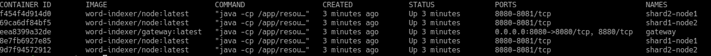
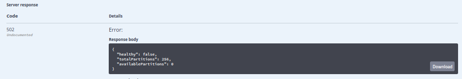

# Building From Source #

## Requirements ##

For building word-indexer:

* JRE >= 1.8

For running it:

* [Docker](https://docs.docker.com/install/) >= 17
* [Docker-compose](https://docs.docker.com/compose/install/) >= 2

## Building ##

Get source code from GitHub:
```
git clone https://github.com/interair/word-indexer.git
```
Change directory into the local repo:

    cd word-indexer

Build the images:
```
./gradlew dockerBuildImage
```
## Running ##

For running the build, you need to install docker and [docker-compose](https://docs.docker.com/compose/install/).
So on command line for running the server: 

    docker-compose up

5 containers will be available:
* Gateway
* Shard 1 (2 replicas)
* Shard 2 (2 replicas)

[Link to docker-compose file](../docker-compose.yml)
##



After startup, it will be available by browsing to API: http://localhost:8080/swagger-ui.html

Check health via 

```
watch curl "http://localhost:8080/health"
```

Example of response:
##


### For testing FT use curl or swagger
* Upload text (2 APIs available)
```
curl -X POST "http://localhost:8080/doc/upload-text?id=test.txt" -H "accept: application/json" -H "Content-Type: text/plain" -d "What is Lorem Ipsum?Lorem Ipsum is simply dummy text of the printing and typesetting industry. Lorem Ipsum has been the industry's standard dummy text ever since the 1500s, when an unknown printer took a galley of type and scrambled it to make a type specimen book. It has survived not only five centuries, but also the leap into electronic typesetting, remaining essentially unchanged. It was popularised in the 1960s with the release of Letraset sheets containing Lorem Ipsum passages, and more recently with desktop publishing software like Aldus PageMaker including versions of Lorem Ipsum."
```    
* Check result
```
watch curl "http://localhost:8080/word/including" -H "accept: application/json"
```
* Stop random shards

```
docker stop shard1-node2 shard2-node2
```
* Check watch from previous step
* Revert containers and stop old
```
docker start shard1-node2 shard2-node2
docker stop shard1-node1 shard2-node1
```
